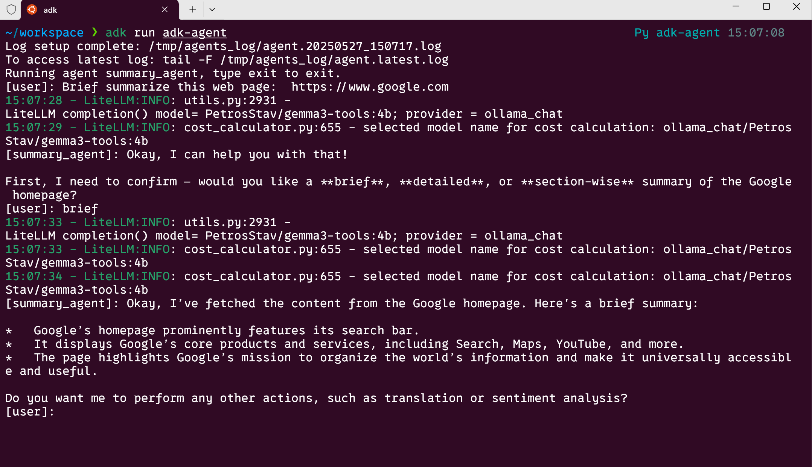

# 🔍 Webpage Summarizer Agent

This project is a local LLM-powered agent that summarizes the content of any webpage given its URL. It uses a tools-capable local language model to fetch and process web content interactively.

---

## 🚀 Features

- 🌐 Fetches and cleans raw webpage content using a Python tool  
- 🧠 Summarizes long-form text using a locally running LLM  
- 🛠️ Compatible with tool-using models like `gemma3-tools:4b` via Ollama  
- 🐍 Virtual environment support using [`uv`](https://github.com/astral-sh/uv)

---

## 🧪 Running Locally

### 1. Confirm the LLM with Tool Support

Make sure you're using a tool-capable model with Ollama:

```bash
# Start the LLM with built-in tools support
ollama pull PetrosStav/gemma3-tools:4b
```

> 🔍 To verify the model supports tools:

```bash
ollama show PetrosStav/gemma3-tools:4b
# Look for a field called "Capabilities" that includes "tools"
```

---

### 2. Setup Python Virtual Environment (via `uv`)

Make sure you have [`uv`](https://github.com/astral-sh/uv) installed:

```bash
# Create virtual environment
uv venv

# Activate virtual environment
source .venv/bin/activate

# Install library
uv pip install -r requirements.txt
```

> 💡 If `uv` is not installed, run:  
> `pip install uv` or `cargo install uv` (if using Rust)

---

### 3. Run the agent locally
```bash
# In parent folder
adk run adk-agent

adk web
```

## 🧰 Tool Overview

The Python tool registered with the LLM allows it to fetch and clean webpage content automatically.  
You can find the function in `tools/web_fetcher.py` (or wherever it's implemented).

```python
def get_webpage_text(url: str) -> str:
    """Fetch and extract readable content from a given web URL."""
    ...
```

---

## 📂 Project Structure (example)

```
.
├── agent.py                # Agent or app entrypoint
├── tools/
│   └── web_fetcher.py      # Tool function to extract webpage content
├── requirements.txt 
├── config.py               # Configuration about the agent
├── prompts.py              # Prompts on what the agent can do, and which too to use      
└── README.md
```

---
## DEMO
adk run adk-agent
